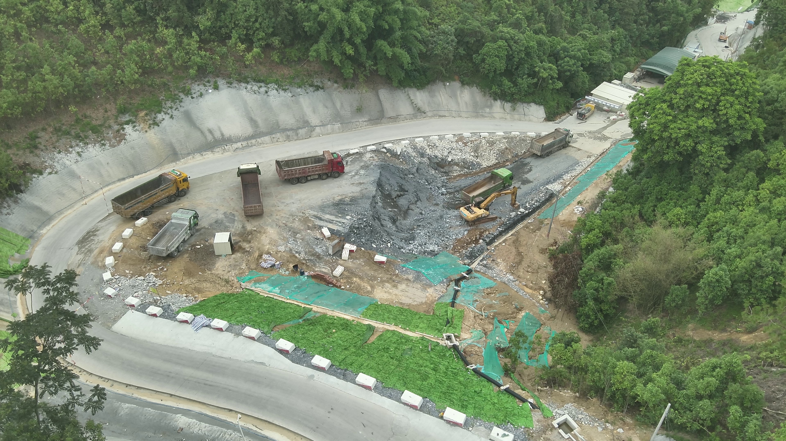
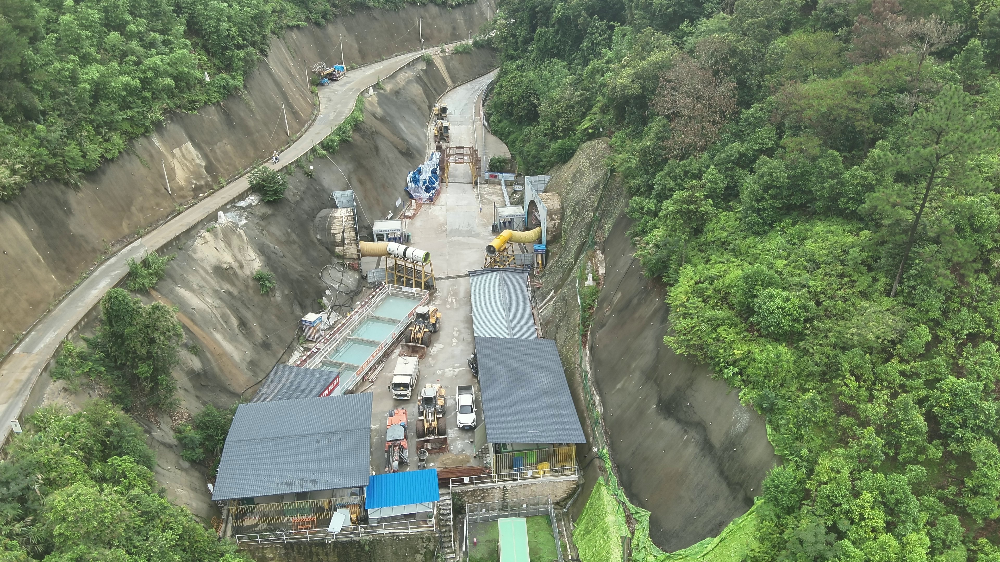
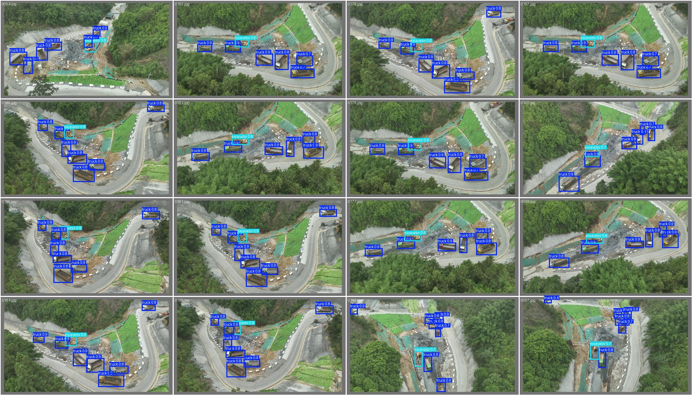
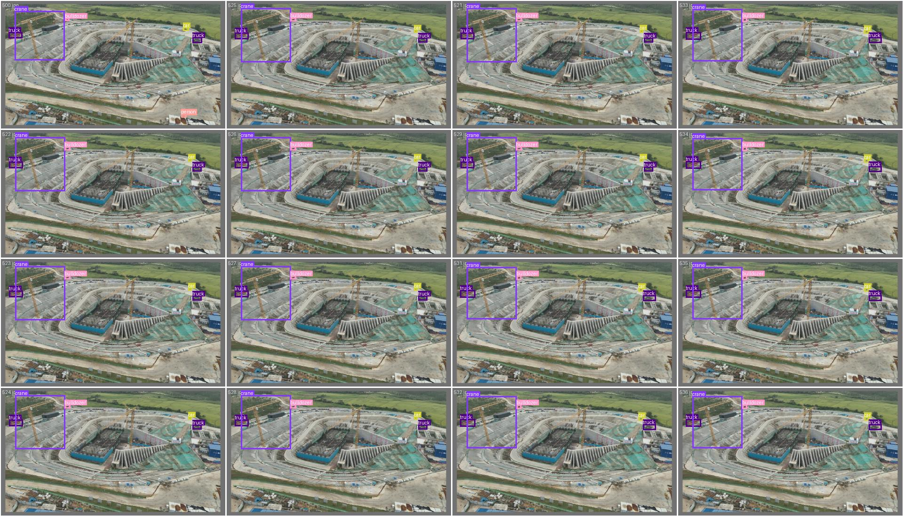
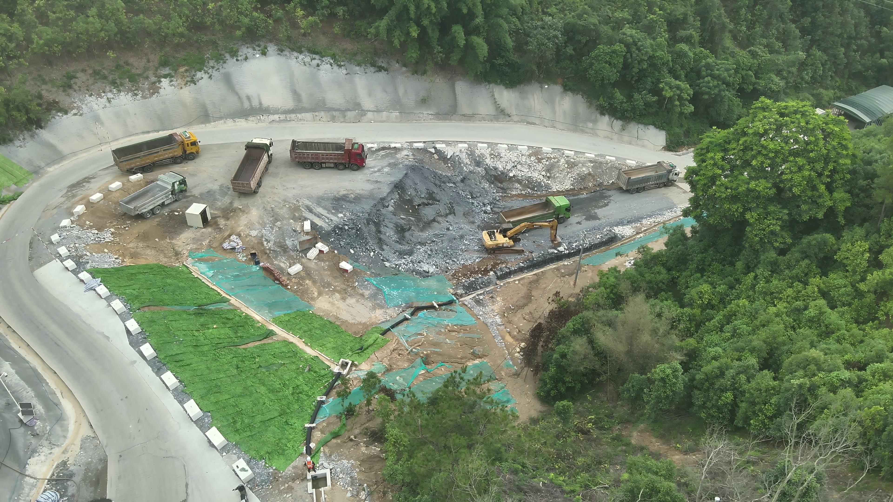
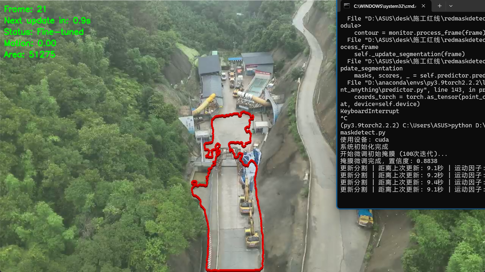
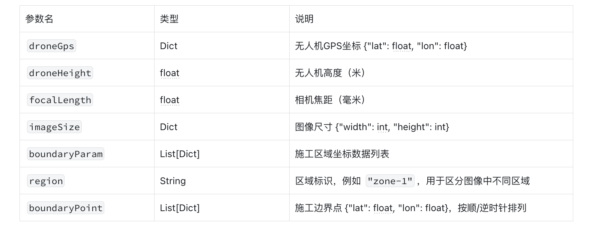
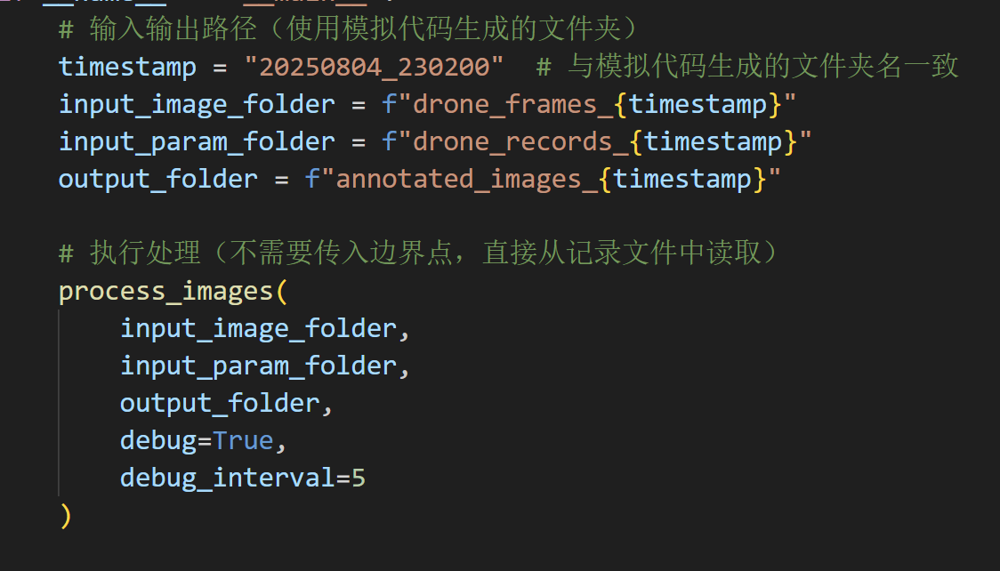
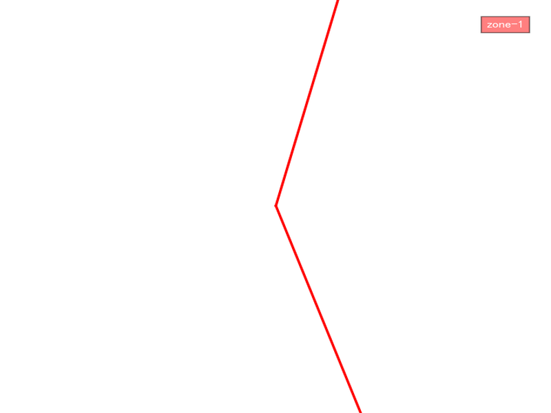
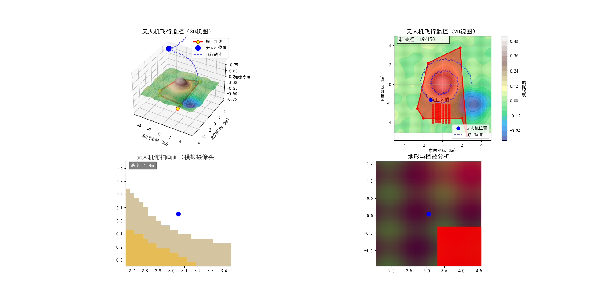

# 本项目是南方电网水务项目，其中包含四类算法，对于水管报关，地面塌陷，山体滑坡，施工用地越界识别，当前主要围绕施工用地越界识别问题。施工红线越界难点第一是红线确定，复杂的施工场景中，施工用地的边界复杂不规则，并且无人机实时移动边界确定存在较大问题。新增最新方案六，方案囊括纯视觉到坐标体系结合，并且新增接口方案app.py 接口返回base64
## 1.数据集场景展示

## 2.方案一--掩膜引导的红线划分目标识别

1. 镜头固定
2. 施工范围在镜头内
3. 高度50m-70米 -25度左右

4. 根据初始掩膜确定施工红线边界+Yolov8目标检测
5. 支持视频和逐帧处理

### 2.1.大致思路

掩膜可以交互绘制或者预先绘制

然后掩膜会叠到视频每一帧，记录帧数

然后识别逻辑就是只框选出红线外的目标

判定越界是在红线外停留三十秒以上即为越界

### 2.2.目标检测

### 2.3.结果

测试时红线是主观绘制，用于测试施工车辆在施工红线内外的识别效果，视频在方案一文件夹中

## 3.方案二--基于Sam的obr特征匹配引导对面积去做特征点匹配

1. 镜头起始可以固定后期可以跟随 光流法和obr特征匹配
2. 施工范围在镜头内
3. 高度50m-70米 -25度左右

3. 根据初始掩膜确定施工红线边界+Yolov8目标检测
4. 支持视频和逐帧处理

### 3.1.大致思路

在方案一基础上增加红线跟踪功能，实现无人机移动的需求，该方案下有三个子修正方案

纯计算机视觉思路使用obr特征点匹配+分割，

纯分割无法应对多场景的需求，并且每次都需要标注大量数据集重新训练，在边缘不清晰并且人为设定红线的需求下，分割方案不适用，并且经过测试效果也不好。

#### 

我们先使用第一帧和第一帧掩膜划定的roi区域去做随机点微调sam，使用了obr提取掩膜绘制的施工区域的特征，对后续帧做特征匹配，我们还计算了分割掩膜的面积作为掩膜生成边界，确定后续的掩膜大致位置再做仿射变换，使用ransac计算单应性矩阵，并且同步保存历史关键帧，引入场景运动因子补偿，并做了性能统计  

结论

sam是保守分割，此方案下会优先按照边缘分割，分割效果会收束到特征比较统一的区域

在后期的调整中也发现面积匹配的方式由于实际施工地的特征分布复杂涵盖过度与周围环境相似特征，引入过多干扰后期做优化时造成反复重复引导分割，文件夹中有视频可见，会有跳变现象

## 4.方案三--obr特征匹配引导对边缘特征做特征匹配

与方案二一点区别在于改为对边缘的特征去匹配 并且使用角点匹配的方式将特征，不再使用sam，直接使用传统计算机视觉光流跟踪的方法，两者都要其实掩膜要与第一帧吻合，文件内有视频

## 5.方案四--基准图储存的SIFT引导特征匹配任意帧映射

仍然需要预选加载掩膜，但是掩膜和对应的原图不需要是视频的第一帧，掩膜和其对应的图作为基准用于类似特征储存的方式，使用SIFT特征+FLANN匹配器，增加匹配筛选和几何验证，只要任意视频的第一帧被的掩膜被正确创建，则后续使用方案三的光流跟踪就能确定红线

与基准掩膜视角越接近生成的掩膜效果越好

## 6.方案五--基于Gps坐标无人机srt文件信息的空间映射红线确定

目前是先使用代码模拟无人机在施工地的拍摄去做的还未现实验证

ground.py是空间模拟代码 redline.py是功能代码

使用以下参数进行投影计算

## 7.方案六--基于gps正射影像的全局坐标确定

